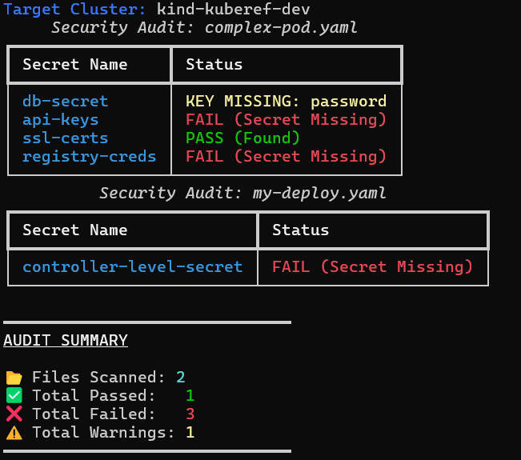

# Kuberef | Kubernetes Secret Reference Validator

**Role:** Developer & Maintainer   
**Status:** Published & Actively Maintained  
**Tech Stack:** Python, Kubernetes API, Docker, GitHub Actions, Poetry, Typer, Rich, PyYAML, PyPI   

A pre-deployment auditing tool built to eliminate CreateContainerConfigError by verifying Kubernetes secrets against live cluster states. Developed using Python and Kubernetes API, utilized Typer and Rich for the CLI interface, PyYAML for manifest parsing, Poetry for package management, and published to PyPI for package distribution.
It features a Recursive Discovery Engine using PyYAML which parses deep-nested specs in multi-document YAMLs, performing checks via live Kubernetes API. Optimized for DevOps workflows with a multi-stage Docker build for cross-platform compatibility, a GitHub Actions CI/CD pipeline for automated testing, and reduces debugging time in infrastructure misconfigurations.

- **Problem:** I noticed a recurring issue in Kubernetes deployments where kubectl apply would succeed, but the containers would crash later and pods were stuck in CreateContainerConfigError due to referencing of a secret that doesn't exist or has the wrong key name. Kubernetes doesn't check these references until the container tries to start. That's because Kubernetes validates YAML syntax but doesn't check if secrets actually exist until the start of container. Thus, there's a gap between deployment time and runtime validation

- **Solution:** Built Kuberef to close this gap by implementing a pre-flight validation CLI in Python that queries the live K8s API to audit every Secret reference before deployment. I had to handle four different reference patterns (env, envFrom, volumes, and imagePullSecrets) and ensure it worked across directories. 

- **The Impact:** The tool is now published on PyPI and can be locally installed using `pip install kuberef`. It shifts error detection to the left—catching misconfigurations in the CI pipeline instead of in Production. It potentially reduces debugging time for Secret-related issues since they never reach the cluster.

# Technical Highlights:
1. **Recursive Discovery:** Traverses nested YAML (Deployments, CronJobs) to find all Secret references regardless of spec depth.
2. **Live API Validation:** Queries the Kubernetes API in real-time to verify Secret existence and specific data-key presence.
3. **Cross-Platform Docker:** Optimized for zero-install usage on Windows and Linux via advanced volume-mounting and network bridging.
4. **Automated Distribution:** Full CI/CD pipeline using GitHub Actions and Poetry for automated testing and PyPI publishing.

# Supported Secret Reference Schemas

Kuberef currently audits the following Kubernetes Secret reference patterns when
scanning manifests. These paths represent the exact schema locations inspected by
the recursive discovery engine.

## 1. Container Environment Variables (env)

Kuberef extracts Secret references from:

`spec.containers[*].env[*].valueFrom.secretKeyRef.name`

and validates the referenced Secret key from:

`spec.containers[*].env[*].valueFrom.secretKeyRef.key`

Example:

```yaml
env:
  - name: DB_PASSWORD
    valueFrom:
      secretKeyRef:
        name: database-secret
        key: password
```

## 2. Bulk Environment Variables (envFrom)

Kuberef extracts Secret names from:

`spec.containers[*].envFrom[*].secretRef.name`

Example:

```yaml
envFrom:
  - secretRef:
      name: database-secret
```

## 3. Secret Volumes (volumes)

Kuberef extracts Secret names from:

`spec.volumes[*].secret.secretName`

Example:

```yaml
volumes:
  - name: app-secret
    secret:
      secretName: database-secret
```

## 4. Image Pull Credentials (imagePullSecrets)

Kuberef extracts Secret names from:

`spec.imagePullSecrets[*].name`

Example:

```yaml
imagePullSecrets:
  - name: dockerhub-secret
```

# Knowledge Growth & Vision: 
1. **Python packaging ecosystem:** Poetry, PyPI publishing, and semantic versioning.   
2. **CI/CD best practices:** GitHub Actions, automated testing, containerization. 
3. **Programmatic K8s:** Moving beyond kubectl to interact with the cluster via the Python Client Library.
4. **Packaging User Experience:** Learning that for a tool to be 'production-grade,' it needs proper exit codes, clear terminal UI (using Rich), and semantic versioning via Poetry.
5. **Container Networking:** Managing the nuances of Docker-on-Windows networking to reach a local kind or minikube cluster.
6. **Open source:** Documentation, licensing, and interaction. 

# Future Roadmap:
1. **Broader Validation:** Extending the recursive engine to support ConfigMaps and PersistentVolumeClaims (PVCs).
2. **Helm Support:** Implementing template parsing for Helm-based workflows.

# Kubectl Plugin Integration

Once installed, `kuberef` can be seamlessly invoked as a native `kubectl` plugin subcommand: `kubectl ref`.

## How It Works
Kubernetes natively supports CLI extensions (plugins) by scanning directories in the system's `$PATH` for any executable prefixed with `kubectl-`. By registering `kubectl-ref` in `pyproject.toml`, our package generates both `kuberef` and `kubectl-ref` executables upon installation, making the tool instantly discoverable by `kubectl`.

## Local Development and Testing Setup
To test the routing mechanism locally before distributing or installing the package globally:

1. **Install in editable mode** using pip within your virtual environment (or poetry) to generate the development build binaries:
   ```bash
   pip install -e .
   ```
2. **Locate the binary:**
   Find the absolute path of the generated `kubectl-ref` executable within your development environment's binary directory (e.g., `.venv/bin/kubectl-ref` on Unix or `.venv/Scripts/kubectl-ref.exe` on Windows).
3. **Manually Symlink/Copy to Path:**
   Create a symlink pointing to the dev binary inside a directory that is globally recognized by your system's `$PATH` (e.g., `/usr/local/bin/` on Unix, or any custom PATH directory on Windows):
   - **Unix (macOS/Linux):**
     ```bash
     ln -s /path/to/virtualenv/bin/kubectl-ref /usr/local/bin/kubectl-ref
     ```
   - **Windows (PowerShell as Admin):**
     ```powershell
     New-Item -ItemType SymbolicLink -Path "C:\path\in\your\PATH\kubectl-ref.exe" -Value "C:\path\to\virtualenv\Scripts\kubectl-ref.exe"
     ```
4. **Verify Routing:**
   Check if `kubectl` discovers the new plugin:
   ```bash
   kubectl plugin list
   ```
   Run the native Kubernetes subcommand to test routing:
   ```bash
   kubectl ref --help
   ```

## Context and Kubeconfig Forwarding
When invoked as `kubectl ref`, the master `kubectl` process handles execution but forwards all flags to the plugin script. Native global flags (like `--context` and `--kubeconfig`) are gracefully intercepted and forwarded to the cluster configuration parser:
```bash
kubectl ref deployment.yaml --context dev-cluster --kubeconfig ~/.kube/config
```

# Technical Challenges: 
1. **Recursive Spec Discovery:** Kubernetes manifests are deeply nested. A Secret might be in a Pod, a Deployment, or a CronJob. Finding every reference without crashing on missing keys was a major logic hurdle.
2. **K8s API Authentication:** Ensuring the tool could use the host's existing cluster credentials inside an isolated Docker container required complex network bridging and volume mapping. 

# Example Output: 


________________________

Copyright (c) 2026 HUDA NAAZ  